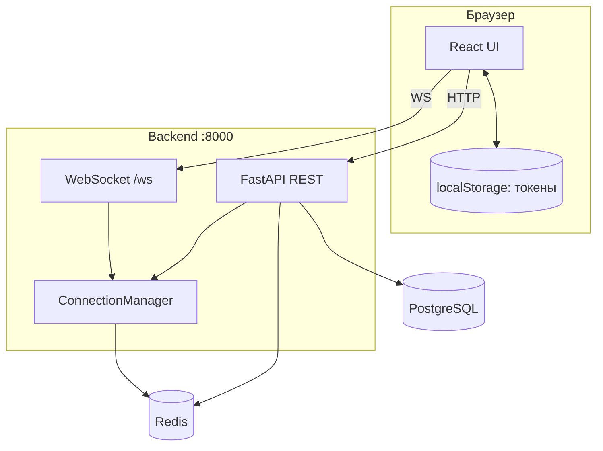
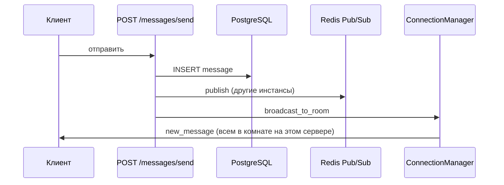

# MsgHub — схема работы приложения

Установка и запуск: [README.md](./README.md).

## Компоненты

| Слой | Технологии |
|------|------------|
| Клиент | React (Vite), `axios` (REST), WebSocket |
| API | FastAPI, JWT (access), сессии refresh в PostgreSQL + кэш в Redis |
| Данные | PostgreSQL (SQLModel) |
| Real-time / масштабирование | Redis (Pub/Sub, онлайн/комнаты), in-memory WebSocket manager |

Фронтенд в `docker-compose` по умолчанию **не** поднимается (закомментирован); обычно запуск на хосте (`localhost:5173`), бэкенд — `localhost:8000`.

## Общая схема

## Аутентификация

1. `POST /auth/register` или `/auth/login` → пара `access_token` + `refresh_token` и **`user_id`** в теле ответа.
2. Клиент хранит токены; в заголовках запросов: `Authorization: Bearer <access>`.
3. `POST /auth/refresh` — ротация refresh-токена.

Access-токен — JWT с полем `user_id`; проверка в `get_current_user` (зависимость роутов).

## REST и WebSocket

| Назначение | Канал |
|------------|--------|
| Друзья, комнаты, история, отправка/редактирование/удаление сообщений | **HTTP** (`/friends`, `/rooms`, `/messages`, …) |
| События в открытой комнате (новое сообщение, редактирование, удаление, прочитано) | **WebSocket** |

Протокол WebSocket (`/ws`):

1. Первое сообщение: `{"action":"auth","token":"<access>"}`.
2. Ответ: `{"action":"authenticated","user_id":...}`.
3. Далее: `join_room` (текущая комната для рассылки), `ping` / `pong`.

## Поток сообщения (real-time)

Слушатель Redis (`pubsub.start_pubsub_listener`) доставляет то же событие на **другие** инстансы бэкенда; локальная рассылка дублируется с фильтром `_server_id`, чтобы не задвоить уведомления на одном процессе.

## Удаление сообщения

1. `DELETE /messages/{message_id}` — только автор; в БД сначала удаляются строки `message_reads` для этого сообщения, затем само сообщение.
2. В комнату уходит событие WebSocket `message_deleted` (+ Redis для других инстансов).

## Замечания по маршрутам

Статические пути (`/messages/unread/count`, `/messages/send`, …) должны объявляться **до** параметризованных (`/messages/{room_id}`), иначе часть запросов может неверно сопоставляться с шаблоном «комната по id».
